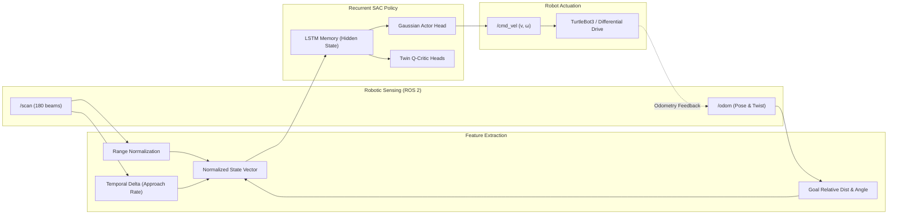
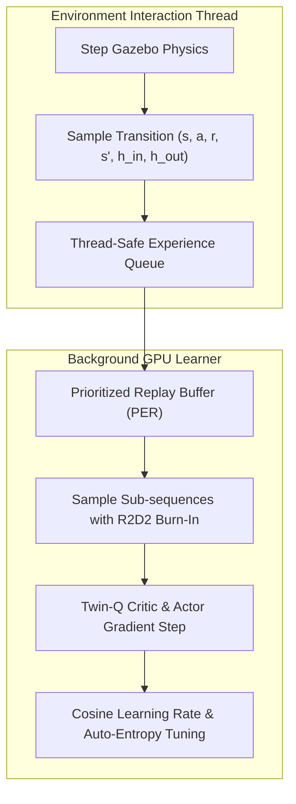

# Distributed Recurrent Deep RL (SAC-LSTM + R2D2 Burn-In) for Partially Observable Dynamic Mapless Navigation

[](https://docs.ros.org/en/humble/)
[](https://gazebosim.org/)
[](https://pytorch.org/)
[](https://arxiv.org/abs/1812.05905)
[](https://openreview.net/forum?id=r1lyNpVuY7)
[](https://github.com/ros2/rmw_zenoh)

A high-performance continuous control system for mapless robot navigation in non-stationary, dynamic environments. The policy addresses the **temporal partial observability problem (POMDP)** by coupling a **Soft Actor-Critic (SAC)** algorithm with **LSTM recurrent memory**, **R2D2-style sequence burn-in**, and **Prioritized Experience Replay (PER)** in ROS 2 Humble and Gazebo.

---

## Table of Contents

1. [Key Engineering Highlights](#key-engineering-highlights)
2. [System Architecture](#system-architecture)
3. [Algorithmic Design & Innovations](#algorithmic-design--innovations)
4. [Benchmark Results](#benchmark-results)
5. [Repository Structure](#repository-structure)
6. [Quickstart & Training](#quickstart--training)
7. [Automated Benchmarking](#automated-benchmarking)
8. [DevContainer & MLOps Infrastructure](#devcontainer--mlops-infrastructure)
9. [Troubleshooting](#troubleshooting)

---

## Key Engineering Highlights

- **Recurrent Continuous Control for POMDPs**: Combines SAC with LSTM memory to infer obstacle velocities directly from 2D range streams without requiring costly tracking filters or global maps.
- **R2D2 Sequence Burn-In (~18× Step Speedup)**: Slices historical trajectories with initial unrolled burn-in steps to eliminate recurrent state staleness while reducing GPU batch processing time from **~0.90s to ~0.05s**.
- **Dynamic-Aware Feature Engineering**: Integrates LiDAR temporal approach rates ($\Delta d_{\text{min}}$) and non-linear closing-speed penalties to mitigate velocity mismatches against moving agents.
- **Zero-Conflict Distributed MLOps**: Employs hash-based deterministic port routing for `rmw_zenohd` and `GAZEBO_MASTER_URI`, enabling parallel experiment containers on a single host without ROS topic leakage or port collisions.
- **Auto-Detecting PyTorch GPU Toolchain**: Dynamically detects the host GPU compute architecture (`sm_86` Ampere, `sm_89` Ada Lovelace, `sm_120` Blackwell) and fetches the matching CUDA wheels at container build time.
- **POMDP Baseline Validation**: Validated on **POPGym** and **Partially Observable MuJoCo (PO-MuJoCo)** benchmarks to decouple and verify memory retention in continuous control prior to robotics deployment.

---

## System Architecture

### 1. Perception-Action Recurrent Control Loop



### 2. Asynchronous Dual-Threaded Training Pipeline



---

## Algorithmic Design & Innovations

### 1. R2D2-Style Sequence Burn-In
In recurrent off-policy RL, updating an LSTM from historical replay data suffers from **recurrent state staleness** (the stored hidden state $h_0$ no longer matches the current network weights). 

Rather than replaying full episodes from step 0 (computationally prohibitive) or using zero-initialized hidden states (damages long-term memory), we implement **sequence burn-in**:
1. Sample an episode segment of length $L = L_{\text{burn-in}} + L_{\text{train}}$ (e.g., $8 + 16 = 24$ steps).
2. Unroll the LSTM across the first $L_{\text{burn-in}}$ steps **without backpropagation** to produce an accurate hidden state $h_{\text{burn-in}}$.
3. Compute critic and actor losses strictly over the subsequent $L_{\text{train}}$ steps with full gradients.

> **Result:** Eliminates state drift while dropping per-step training latency from **~0.9s down to ~0.05s**.

### 2. Dynamic-Aware Reward Formulation
Navigating dynamic obstacles requires the agent to balance forward progression with anticipatory collision avoidance:

$$\mathcal{R}_t = r_{\text{progress}} + w_d \cdot r_{\text{distance}} + r_{\text{safety}} + r_{\text{closing}} + r_{\text{time}} + r_{\text{vel}}$$

Where:
- **Progress Reward:** $r_{\text{progress}} = k_p \cdot \text{clip}(d_{t-1} - d_t, -0.05, 0.05)$
- **Nonlinear Safety Penalty:** $r_{\text{safety}} = -k_s \cdot \left(\frac{d_{\text{safe}} - d_{\text{min}}}{d_{\text{safe}} - d_{\text{coll}}}\right)^2$ when $d_{\text{min}} < d_{\text{safe}}$
- **Closing-Speed Anticipation:** $r_{\text{closing}} = k_c \cdot \Delta d_{\text{min}}$ if $\Delta d_{\text{min}} < 0$ (penalizes rapid approach towards dynamic obstacles)
- **Time Regularization:** $r_{\text{time}} = -0.017$ to encourage minimum-time trajectories

---

## Benchmark Results

### Gazebo Navigation Performance

Evaluation over 50 test episodes per stage (100 episodes for `turtlebot_world`). All stages evaluated using a **single unified policy** trained on dynamic curriculum environments:

| Metric | turtlebot_world | Stage 1 (Static) | Stage 2 (Static) | Stage 3 (Moving Obs.) | Stage 4 (Dynamic Obs.) |
|:---|:---:|:---:|:---:|:---:|:---:|
| **Total Episodes** | 100 | 50 | 50 | 50 | 50 |
| **Success Rate** | **78.0%** | **100.0%** | **100.0%** | **46.0%** | **80.0%** |
| **Collisions** | 22 | 0 | 0 | 27 | 10 |
| **Mean Reward** | 34.62 | 76.72 | 70.39 | 2.66 | 44.02 |
| **Mean Steps (Succ.)** | 166.4 | 286.4 | 245.1 | 138.2 | 250.7 |

> **Key Takeaway:** The recurrent policy achieves **100% success** on static configurations and **80% success** in complex Stage 4 dynamic scenarios. In Stage 3, obstacle-robot speed mismatches remain an open challenge motivating the integration of control barrier functions.

### POPGym POMDP Benchmark

Memory retention validation across partially-observable tasks (comparing recurrent models against feedforward baselines):

| Task | Difficulty | SAC-LSTM + PER | SAC-LSTM (Uniform) | SAC-MLP Baseline |
|:---|:---:|:---:|:---:|:---:|
| **RepeatPrevious** | Easy | **1.0** (Solved) | **1.0** (Solved) | 0.2 |
| **PositionOnlyCartPole** | Easy | **0.90** | 0.70 | 0.20 |
| **PositionOnlyCartPole** | Medium | **0.70** | 0.60 | 0.10 |
| **HigherLower** | Easy | **0.50** | 0.50 | 0.25 |

---

## Repository Structure

```
Mapless_RL_Navigation/
├── .devcontainer/              # Isolated DevContainer (ROS2 Humble, Zenoh, PyTorch)
│   ├── Dockerfile
│   └── devcontainer.json
├── .scripts/                   # Environment bootstrap & automated GPU toolchain
│   ├── install_torch.sh        # Dynamic CUDA wheel selector (sm_86, sm_89, sm_120)
│   ├── post_create.sh          # Colcon workspace builder & venv setup
│   └── start_tmux.sh           # Multiplexed training console session
├── docs/
│   └── media/                  # GIF & video assets for visual benchmarks
├── models/                     # Saved checkpoint weights (.gitkeep)
├── runs/                       # TensorBoard experiment event logs (.gitkeep)
├── src/
│   ├── config/                 # Centralized environment & algorithm parameters
│   │   ├── __init__.py
│   │   └── config.py
│   ├── envs/                   # Gymnasium ROS 2 Gazebo environment interface
│   │   ├── gazebo_initial_pose_node_for_all_models.py
│   │   └── pgrc_env_map_goal.py
│   ├── sac_agent/              # Core SAC algorithm implementation
│   │   ├── common/             # Buffers (PER + Burn-In), Value & Policy networks
│   │   ├── sac_v2_lstm_R.py    # Recurrent SAC Trainer
│   │   └── sac_v2_mlp.py       # Feedforward SAC Trainer
│   ├── train/                  # Main training scripts
│   │   ├── train_lstm.py       # SAC-LSTM continuous trainer
│   │   ├── train_mlp.py        # SAC-MLP feedforward baseline
│   │   └── train_sb3.py        # Stable-Baselines3 baseline suite
│   ├── evaluate/               # Autonomous testing & checkpoint evaluation
│   │   └── testing_model.py
│   ├── benchmark/              # Automated experiment runner & reporting
│   │   ├── config.py           # Experiment registry
│   │   ├── runner.py           # CLI experiment runner
│   │   └── results/            # Results parser, LaTeX/Markdown reporter
│   ├── tools/                  # Verification utilities (LiDAR polar web server)
│   │   ├── lidar.py
│   │   └── visualize_scan.py
│   └── tune/                   # Optuna hyperparameter & reward weight search
├── requirements.txt            # Python dependencies (excluding PyTorch)
└── README.md
```

---

## Quickstart & Training

### 1. Launch the Gazebo Simulation Environment

```bash
# Set simulation model and launch dynamic obstacle stage
export TURTLEBOT3_MODEL=burger
ros2 launch turtlebot3_gazebo turtlebot3_dqn_stage4_moving_obs.launch.py gui:=false
```

### 2. Start the Pose Synchronization Node

In a separate terminal (or tmux pane):

```bash
python3 src/envs/gazebo_initial_pose_node_for_all_models.py
```

### 3. Train the SAC-LSTM Model

```bash
# Run training with Prioritized Experience Replay and R2D2 Burn-In
python3 src/train/train_lstm.py --train --buffer-type per

# Or train with uniform replay buffer (ablation)
python3 src/train/train_lstm.py --train --buffer-type uniform
```

### 4. Evaluate Checkpoints

```bash
# Evaluate a trained policy over 50 test episodes
python3 src/evaluate/testing_model.py \
    --model_dir ./models/sac_lstm_checkpoints/ \
    --models best_eval_model_ep_900 \
    --episodes 50
```

### 5. Live Metric Tracking

```bash
tensorboard --logdir ./runs/ --port 6007
```

---

## Automated Benchmarking

The automated benchmark harness allows executing reproducible runs across multiple seeds and algorithms:

```bash
# List all registered experiments
python3 -m benchmark.runner --list

# Perform a dry-run (preview commands without executing)
python3 -m benchmark.runner --dry-run

# Run full evaluation across seeds 42, 123, 456
python3 -m benchmark.runner --experiments sac_lstm_per sac_mlp --seeds 42 123 456

# Generate a formatted markdown/latex summary report
python3 -m benchmark.results.generate_report --domain gazebo --format markdown
```

---

## DevContainer & MLOps Infrastructure

### Zenoh Dynamic Port Hashing
When running multiple containers or automated benchmarks concurrently, default ROS 2 DDS and Gazebo ports will collide. The environment automatically isolates every workspace:

```bash
# Deterministic hash-based port assignment (in /etc/bash.bashrc)
ZENOH_PORT=$(( 7448 + $(echo "$WORKSPACE_NAME" | cksum | cut -d' ' -f1) % 100 ))
GAZEBO_PORT=$(( 11345 + $(echo "$WORKSPACE_NAME" | cksum | cut -d' ' -f1) % 100 ))
```

### Live Monitoring of Headless Simulations
Headless training runs `gzserver` without the GUI overhead. To inspect the robot live without disturbing ongoing training:

```bash
# Attach Gazebo GUI viewer to the running gzserver instance
export DISPLAY=:1
gzclient
```
*(Closing `gzclient` terminates only the visual viewer; training continues unhindered).*

---

## Troubleshooting

### ROS 2 Daemon Reset
If `ros2 topic list` hangs or reports `xmlrpc.client.Fault: <Fault 1: "!rclpy.ok()">`:
```bash
ros2 daemon stop && ros2 daemon start && sleep 2
ros2 topic list
```

### Display / X11 Access
If `gzclient` fails with `could not connect to display`:
```bash
# From the host machine:
xhost +local:docker
```

---

## Citation & Acknowledgments

If you find this work or infrastructure useful, feel free to star the repository and reference it in your robotics projects.